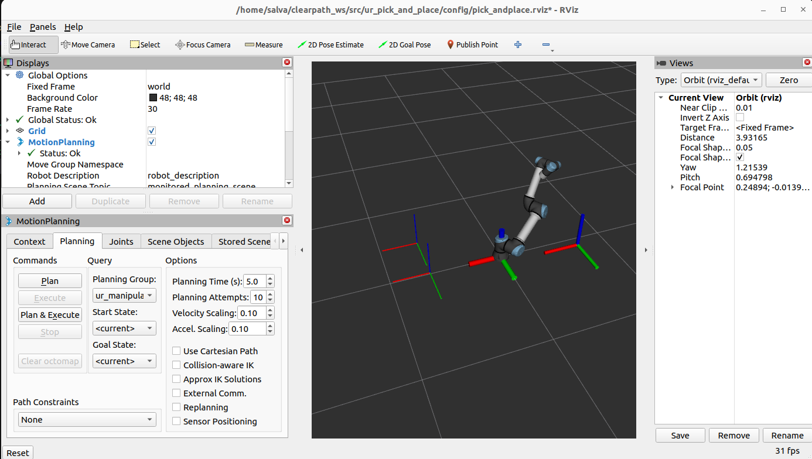

# UR5e Pick and Place with MoveIt 2

This package provides a simple example of a **pick-and-place pipeline** for the **UR5e robot** using **MoveIt 2** in ROS 2 Humble.  
The node subscribes to a list of target poses, moves the robot to each target, and then returns to a predefined **home pose**.  
The home pose is also published so it can be visualized in RViz.

---

## 📦 Installation

Clone this package into your ROS 2 workspace:

```bash
cd ~/clearpath_ws/src
git clone <your_repo_url> ur_pick_and_place
```

Make sure you have the required dependencies:

```bash
sudo apt update
sudo apt install ros-humble-moveit ros-humble-ur-moveit-config ros-humble-ur-simulation-gz
```

---

## ⚙️ Build the package

From the workspace root:

```bash
cd ~/clearpath_ws
colcon build --packages-select ur_pick_and_place
source install/setup.bash
```

---

## ▶️ Run the simulation

Start the UR5e robot with MoveIt in Gazebo:

```bash
ros2 launch ur_simulation_gz ur_sim_moveit.launch.py ur_type:=ur5e
```

---

## ▶️ Run the pick-and-place node

In another terminal:

```bash
source ~/clearpath_ws/install/setup.bash
ros2 run ur_pick_and_place pick_place_node
```

You should see logs such as:

```
[INFO] [pick_place_node]: PickPlaceNode ready. Waiting for poses on /goal_poses...
```

---

## 📨 Publish goal poses

To test the pipeline, publish some poses to the `/goal_poses` topic:

```bash
ros2 topic pub /goal_poses geometry_msgs/PoseArray "{
  header: {frame_id: 'base_link'},
  poses: [
    {position: {x: 0.4, y: 0.2, z: 0.2}, orientation: {w: 1.0}},
    {position: {x: 0.4, y: -0.2, z: 0.2}, orientation: {w: 1.0}}
  ]
}"
```

The robot will move to each target pose and then return to the **home pose**, waiting 3 seconds at each stop.

---

## 📊 RViz Visualization

Launch RViz with MoveIt (this is included in the Gazebo launch).  
The home pose is published on `/home_pose` as a `PoseStamped`, so you can add a **Pose display** in RViz to visualize it.

You can also load the RViz configuration provided in the [`config/`](config/) folder  
(e.g., `pick_and_place.rviz`) to quickly reproduce the scene shown below:


Example screenshot:



---

## 📌 Features

- Reads an array of goal poses from `/goal_poses`.  
- Moves to each pose using MoveIt’s `MoveGroupInterface`.  
- Returns to a predefined **home pose** after each target.  
- Publishes the **home pose** periodically on `/home_pose`.  
- Waits **3 seconds** at each target and at home.  

---

## 🛠️ Next steps

- Improve trajectory generation (smoother paths, optimized execution time).  
- Adapt the type of pose array depending on external conditions (e.g., fruit maturity classification).  
- Include object descriptions in the planning scene (e.g., the box/container where fruit will be deposited).  
- Integrate ArUco or YOLO-based perception to generate dynamic pick targets.  
- Extend the code to grasp objects with a UR end-effector.
